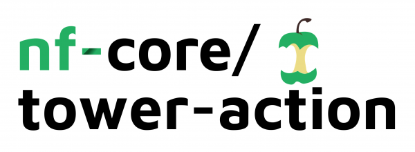
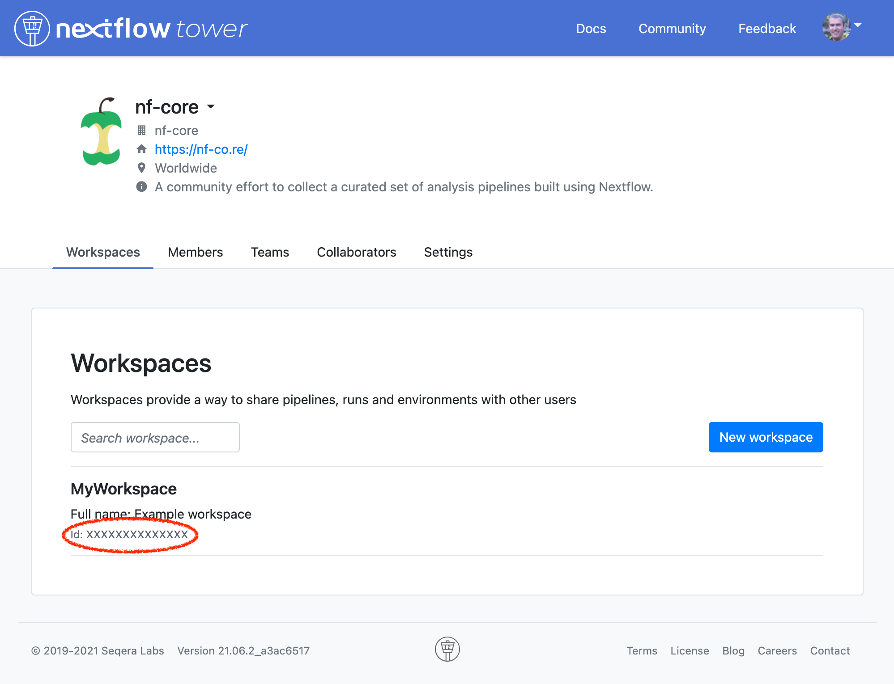

# 

**A GitHub Action to launch a workflow using [Nextflow Tower](https://tower.nf) - <https://tower.nf>.**

This action uses the [Nextflow Tower CLI](https://github.com/seqeralabs/tower-cli/).

## Example usage

### Minimal example

This runs the current GitHub repository pieline on [Nextflow Tower](https://tower.nf) at the current commit hash when pushed to the `dev` branch. The workflow runs on the user's personal workspace.

```yaml
on:
  push:
    branches: [dev]

jobs:
  run-tower:
    runs-on: ubuntu-latest
    steps:
      - uses: nf-core/tower-action@v2
        # Use repository secrets for sensitive fields
        with:
          access_token: ${{ secrets.TOWER_ACCESS_TOKEN }}
```

### Complete example

This example never runs automatically, but creates a button under the GitHub repository _Actions_ tab that can be used to manually trigger the workflow.

It runs on a specified installation of Tower, with a specific organisation workspace. It also calls an external pipeline to be run at a pinned version tag.

The `--outdir` parameter is used to save results to a separate directory in the AWS bucket and the pipeline uses two config profiles.

```yaml
name: Launch on Tower

# Manually trigger the action with a button in GitHub
# Alternatively, trigger on release / push etc.
on:
  workflow_dispatch:

jobs:
  run-tower:
    name: Launch on Nextflow Tower
    # Don't try to run on forked repos
    if: github.repository == 'YOUR_USERNAME/REPO'
    runs-on: ubuntu-latest
    steps:
      - uses: nf-core/tower-action@v2
        # Use repository secrets for sensitive fields
        with:
          workspace_id: ${{ secrets.TOWER_WORKSPACE_ID }}
          access_token: ${{ secrets.TOWER_ACCESS_TOKEN }}
          api_endpoint: ${{ secrets.TOWER_API_ENDPOINT }}
          compute_env: ${{ secrets.TOWER_COMPUTE_ENV }}
          pipeline: YOUR_USERNAME/REPO
          revision: v1.2.1
          workdir: ${{ secrets.AWS_S3_BUCKET }}/work/${{ github.sha }}
          # Set any custom pipeline params here - JSON object as a string
          parameters: |
            {
                "outdir": "${{ secrets.AWS_S3_BUCKET }}/results/${{ github.sha }}"
            }
          # List of pipeline config profiles to use - comma separated list as a string
          profiles: test,aws_tower
```

## Inputs

Please note that a number of these inputs are sensitive and should be kept secure. We recommend saving them as appropriate using GitHub repository [encrypted secrets](https://docs.github.com/en/actions/reference/encrypted-secrets). They can then be accessed with `${{ secrets.SECRET_NAME }}` in your GitHub actions workflow.

Note that if you are using secrets, these will be screened in the GitHub Actions log and appear as `***`.

### `access_token`

**[Required]** Nextflow Tower personal access token.

Visit <https://tower.nf/tokens> to generate a new access token.

See the [Nextflow Tower documentation for more details](https://help.tower.nf/getting-started/usage/#via-nextflow-run-command):


### `workspace_id`

**[Optional]** Nextflow Tower workspace ID.

Nextflow Tower organisations can have multiple _Workspaces_. Use this field to choose a specific workspace.

Default: Your personal user's workspace.

Your Workspace ID can be found in the organisation's _Workspaces_ tab:



Default: Your primary workspace.

### `compute_env`

**[Optional]** Nextflow Tower compute environment name _(not ID)_.

Default: Your primary compute environment.

### `api_endpoint`

**[Optional]** Nextflow Tower API URL endpoint.

Default: `api.tower.nf`

### `pipeline`

**[Optional]** Pipeline repository name.

For example, `nf-core/rnaseq` or `https://github.com/nf-core/sarek`.
Can also be the name of a preconfigured pipeline in Nextflow Tower.

Default: The current GitHub repository (`github.repository`).

### `revision`

**[Optional]** Pipeline revision.

A pipeline release tag, branch or commit hash.

Default: The current GitHub commit hash (`github.sha`).

### `workdir`

**[Required]** Nextflow work directory.

The location that temporary working files should be stored. Must be accessible in the Nextflow Tower compute environment used.

### `parameters`

**[Optional]** Pipeline parameters.

Additional pipeline parameters.

These should be supplied as a valid JSON object, quoted as a string in your GitHub Actions workflow. See example usage above for an example.

> JSON is required (not YAML) because we do some parsing and dumping to ensure that the action handles multi-line string formatting correctly.

### `profiles`

**[Optional]** Nextflow config profiles.

Pipeline config profiles to use. Should be comma separated without spaces.

### `pre_run_script`

**[Optional]** Pre-run script before launch.

Pre-run script executed before pipeline launch.

## Credits

This GitHub Action was written by Phil Ewels ([@ewels](https://github.com/ewels)), with help from and based on earlier work by Gisela Gabernet ([@ggabernet](https://github.com/ggabernet)).

## Citation

If you use `nf-core/tower-action` in your work, please cite the `nf-core` publication as follows:

> **The nf-core framework for community-curated bioinformatics pipelines.**
>
> Philip Ewels, Alexander Peltzer, Sven Fillinger, Harshil Patel, Johannes Alneberg, Andreas Wilm, Maxime Ulysse Garcia, Paolo Di Tommaso & Sven Nahnsen.
>
> _Nat Biotechnol._ 2020 Feb 13. doi: [10.1038/s41587-020-0439-x](https://dx.doi.org/10.1038/s41587-020-0439-x).
